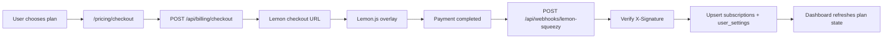

# Lemon Squeezy Billing

Bu dokuman projedeki Lemon Squeezy abonelik entegrasyonunun kurulumunu ve calisma mantigini ozetler.

## Gerekli environment degiskenleri

```env
NEXT_PUBLIC_APP_URL=https://qrpublish.com
NEXT_PUBLIC_SITE_URL=https://qrpublish.com
APP_URL=https://qrpublish.com

LEMONSQUEEZY_API_KEY=
LEMONSQUEEZY_STORE_ID=
LEMONSQUEEZY_WEBHOOK_SECRET=
LEMONSQUEEZY_TEST_MODE=true

LEMONSQUEEZY_STARTER_MONTHLY_VARIANT_ID=
LEMONSQUEEZY_STARTER_YEARLY_VARIANT_ID=
LEMONSQUEEZY_PRO_MONTHLY_VARIANT_ID=
LEMONSQUEEZY_PRO_YEARLY_VARIANT_ID=
```

## Nereden alinir

- `LEMONSQUEEZY_API_KEY`: Lemon Squeezy dashboard > Settings > API.
- `LEMONSQUEEZY_STORE_ID`: store detayinda veya API store listesinde.
- Variant ID'ler: urun veya variant detay ekranindan.
- `LEMONSQUEEZY_WEBHOOK_SECRET`: webhook olustururken belirlediginiz signing secret.

## Hangi endpoint hangi env'i ister

- Checkout acilisi icin: `NEXT_PUBLIC_APP_URL`, `LEMONSQUEEZY_API_KEY`, `LEMONSQUEEZY_STORE_ID` ve secilen planin variant ID'si gerekir.
- Customer portal sorgusu icin: `LEMONSQUEEZY_API_KEY` gerekir.
- Webhook imza dogrulamasi icin: `LEMONSQUEEZY_WEBHOOK_SECRET` gerekir.

## Kullanilan plan anahtarlari

Standart (sabit fiyat) checkout — `POST /api/billing/checkout`:

- `starter_monthly`
- `starter_yearly`
- `pro_monthly`
- `pro_yearly`

Enterprise (per-configuration, `custom_price`) — sadece teklif rotasi uzerinden
(`POST /api/enterprise/quotes`), standart checkout'a **kabul edilmez**:

- `enterprise_monthly`
- `enterprise_yearly`

Frontend standart checkout icin sadece starter/pro anahtarlarini gonderir. Enterprise
anahtarlari webhook'un aboneligi plana geri cozebilmesi icin `custom_data.plan_key`
ile ve/veya variant ID uzerinden kullanilir. Variant ID eslestirmesi tamamen server
tarafinda tutulur.

## Endpointler

- `POST /api/billing/checkout`
- `GET /api/billing/portal`
- `POST /api/webhooks/lemon-squeezy`

## Webhook URL

```text
https://YOUR_DOMAIN/api/webhooks/lemon-squeezy
```

## Lemon Squeezy panelinde secilecek webhook eventleri

- `subscription_created`
- `subscription_updated`
- `subscription_cancelled`
- `subscription_resumed`
- `subscription_expired`
- `subscription_paused`
- `subscription_unpaused`
- `subscription_payment_success`
- `subscription_payment_failed`
- `subscription_payment_recovered`
- `subscription_payment_refunded`
- `order_created`
- `order_refunded`

## Test mode kullanimi

- Test ortaminda `LEMONSQUEEZY_TEST_MODE=true` tutun.
- Test store ve test variant ID'leri kullanin.
- Test mode checkout ve webhook'lar live moddan ayridir.

## Local webhook test yontemi

1. Uygulamayi lokal olarak calistirin.
2. HTTPS tunnel kullanin.
3. Tunnel URL'sini Lemon Squeezy webhook adresi olarak kaydedin.
4. Test mode subscription olusturun veya panelden webhook simulate edin.

## Production oncesi kontrol listesi

- `NEXT_PUBLIC_APP_URL` production domainine ayarlandi.
- Tüm variant ID'ler dogru ortama ait.
- Webhook URL production domaine isaret ediyor.
- Test mode kapatildi: `LEMONSQUEEZY_TEST_MODE=false`.
- Dashboard odeme donusu ve portal akisi live ortamda smoke test edildi.

## Checkout ve webhook akis diyagrami



## Status mapping

| Lemon status | Internal status | Access note |
|---|---|---|
| `active` | `active` | Paid access open |
| `on_trial` | `trial` | Paid access open |
| `past_due` | `past_due` | Temporary grace behavior |
| `cancelled` | `cancelled` | Access remains until `ends_at` |
| `expired` | `expired` | Paid access closed after grace |
| `paused` | `paused` | Creation blocked |
| `unpaid` | `unpaid` | Paid access blocked |

## Webhook payload semalari

Lemon Squeezy her event icin ayni `data.type` degerini kullanmaz, bu yuzden webhook
route'u tek bir "subscription" semasini tum eventlere zorlamiyor:

| Event grubu | `data.type` | Sema/handler |
|---|---|---|
| `subscription_created`, `subscription_updated`, `subscription_cancelled`, `subscription_resumed`, `subscription_expired`, `subscription_paused`, `subscription_unpaused` | `subscriptions` | `subscriptionResourceSchema` + `handleSubscriptionLifecycleEvent` |
| `subscription_payment_success`, `subscription_payment_failed`, `subscription_payment_recovered`, `subscription_payment_refunded` | `subscription-invoices` | `subscriptionInvoiceResourceSchema` + `handleSubscriptionInvoiceEvent` |
| `order_created`, `order_refunded` | `orders` | `orderResourceSchema` + `handleOrderEvent` |

Imzasi gecerli ama yukaridaki listede olmayan bir event gelirse route 400 degil
**200 `{ ok: true, ignored: true }`** doner ve "ignored" olarak loglanir — Lemon
Squeezy boylece sonsuz retry yapmaz.

`subscription_payment_success`/`recovered`/`failed`/`refunded` eventleri ayrica
`billing_payment_history` tablosuna (`provider, provider_invoice_id` uzerinde
unique) idempotent olarak yazilir.

## Environment degisikligi sonrasi restart

`.env.local` veya production env degiskenleri (ozellikle
`LEMONSQUEEZY_WEBHOOK_SECRET`, `LEMONSQUEEZY_API_KEY`, variant ID'ler)
degistirildiginde **process yeniden baslatilmadan** degisiklik etkili olmaz —
`next start` ortam degiskenlerini sadece process baslarken okur.

Bu projede process pm2 ile `qrcode` adiyla calisiyor, restart icin:

```bash
pm2 restart qrcode --update-env
```

`--update-env` bayragi olmadan pm2 eski process'in ortam degiskenlerini
miras alabilir; env dosyasi degistiginde bunu unutmayin.

## Sorun giderme

- Overlay acilmiyorsa checkout yine hosted URL'e yonlenir.
- `401 Invalid signature` / `Missing signature` gorurseniz webhook secret'i ve
  Lemon Squeezy panelindeki signing secret'in birbiriyle eslestigini kontrol edin.
- `500 Webhook is not configured` gorurseniz `LEMONSQUEEZY_WEBHOOK_SECRET` deploy
  ortaminda tanimli degil — env'i ekleyip process'i restart edin (yukarida).
- `400 Invalid payload` / `Invalid webhook envelope` / `Invalid event payload`
  loglarinda hangi event ve hangi alanin basarisiz oldugu ayrintili olarak
  goruluyor — Supabase loglarinda `[lemon-webhook]` prefix'i ile arayin.
- Plan aktif gorunmuyorsa once webhook'un uygulamaya ulasip ulasmadigini, sonra
  `subscriptions` ve `billing_payment_history` tablolarini kontrol edin.
- Customer portal acilmiyorsa subscription ID'nin Lemon tarafinda halen gecerli oldugunu dogrulayin.
- Enterprise self-serve checkout artik desteklenmektedir: `lib/billing/plans.ts`
  `enterprise_monthly`/`enterprise_yearly` anahtarlarini
  `LEMONSQUEEZY_ENTERPRISE_MONTHLY_VARIANT_ID` / `LEMONSQUEEZY_ENTERPRISE_YEARLY_VARIANT_ID`
  env'lerine baglar. Enterprise plan aktif gorunmuyorsa: (1) iki variant ID env'i
  de dolu mu, (2) checkout login'li kullaniciyla mi olusturuldu (anonim ise webhook
  kullaniciyi eslestiremez), (3) `enterprise_quotes` satirinda `quote_id` webhook
  `custom_data`'da geri geldi mi — kontrol edin.
