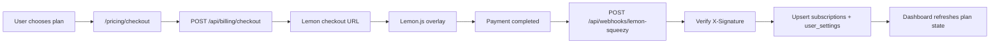

# Lemon Squeezy Billing

Bu dokuman projedeki Lemon Squeezy abonelik entegrasyonunun kurulumunu ve calisma mantigini ozetler.

## Gerekli environment degiskenleri

```env
NEXT_PUBLIC_APP_URL=

LEMONSQUEEZY_API_KEY=
LEMONSQUEEZY_STORE_ID=
LEMONSQUEEZY_WEBHOOK_SECRET=
LEMONSQUEEZY_TEST_MODE=true

LEMONSQUEEZY_STARTER_MONTHLY_VARIANT_ID=
LEMONSQUEEZY_STARTER_YEARLY_VARIANT_ID=
LEMONSQUEEZY_PRO_MONTHLY_VARIANT_ID=
LEMONSQUEEZY_PRO_YEARLY_VARIANT_ID=
```

## Nereden alinir

- `LEMONSQUEEZY_API_KEY`: Lemon Squeezy dashboard > Settings > API.
- `LEMONSQUEEZY_STORE_ID`: store detayinda veya API store listesinde.
- Variant ID'ler: urun veya variant detay ekranindan.
- `LEMONSQUEEZY_WEBHOOK_SECRET`: webhook olustururken belirlediginiz signing secret.

## Hangi endpoint hangi env'i ister

- Checkout acilisi icin: `NEXT_PUBLIC_APP_URL`, `LEMONSQUEEZY_API_KEY`, `LEMONSQUEEZY_STORE_ID` ve secilen planin variant ID'si gerekir.
- Customer portal sorgusu icin: `LEMONSQUEEZY_API_KEY` gerekir.
- Webhook imza dogrulamasi icin: `LEMONSQUEEZY_WEBHOOK_SECRET` gerekir.

## Kullanilan plan anahtarlari

- `starter_monthly`
- `starter_yearly`
- `pro_monthly`
- `pro_yearly`

Frontend sadece bu anahtarlari gonderir. Variant ID eslestirmesi tamamen server tarafinda tutulur.

## Endpointler

- `POST /api/billing/checkout`
- `GET /api/billing/portal`
- `POST /api/webhooks/lemon-squeezy`

## Webhook URL

```text
https://YOUR_DOMAIN/api/webhooks/lemon-squeezy
```

## Lemon Squeezy panelinde secilecek webhook eventleri

- `subscription_created`
- `subscription_updated`
- `subscription_cancelled`
- `subscription_resumed`
- `subscription_expired`
- `subscription_paused`
- `subscription_unpaused`
- `subscription_payment_success`
- `subscription_payment_failed`
- `subscription_payment_recovered`

## Test mode kullanimi

- Test ortaminda `LEMONSQUEEZY_TEST_MODE=true` tutun.
- Test store ve test variant ID'leri kullanin.
- Test mode checkout ve webhook'lar live moddan ayridir.

## Local webhook test yontemi

1. Uygulamayi lokal olarak calistirin.
2. HTTPS tunnel kullanin.
3. Tunnel URL'sini Lemon Squeezy webhook adresi olarak kaydedin.
4. Test mode subscription olusturun veya panelden webhook simulate edin.

## Production oncesi kontrol listesi

- `NEXT_PUBLIC_APP_URL` production domainine ayarlandi.
- Tüm variant ID'ler dogru ortama ait.
- Webhook URL production domaine isaret ediyor.
- Test mode kapatildi: `LEMONSQUEEZY_TEST_MODE=false`.
- Dashboard odeme donusu ve portal akisi live ortamda smoke test edildi.

## Checkout ve webhook akis diyagrami



## Status mapping

| Lemon status | Internal status | Access note |
|---|---|---|
| `active` | `active` | Paid access open |
| `on_trial` | `trial` | Paid access open |
| `past_due` | `past_due` | Temporary grace behavior |
| `cancelled` | `cancelled` | Access remains until `ends_at` |
| `expired` | `expired` | Paid access closed after grace |
| `paused` | `paused` | Creation blocked |
| `unpaid` | `unpaid` | Paid access blocked |

## Sorun giderme

- Overlay acilmiyorsa checkout yine hosted URL'e yonlenir.
- `401 Invalid signature` gorurseniz webhook secret'i kontrol edin.
- Plan aktif gorunmuyorsa once webhook'un uygulamaya ulasip ulasmadigini, sonra `subscriptions` tablosunu kontrol edin.
- Customer portal acilmiyorsa subscription ID'nin Lemon tarafinda halen gecerli oldugunu dogrulayin.
